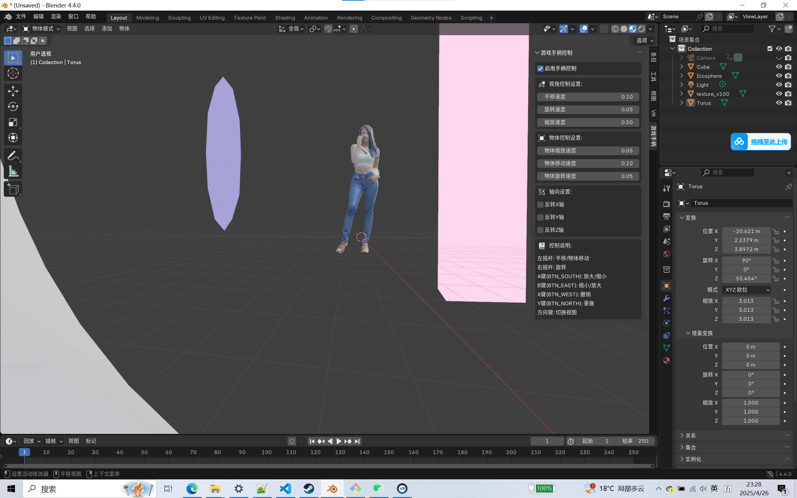
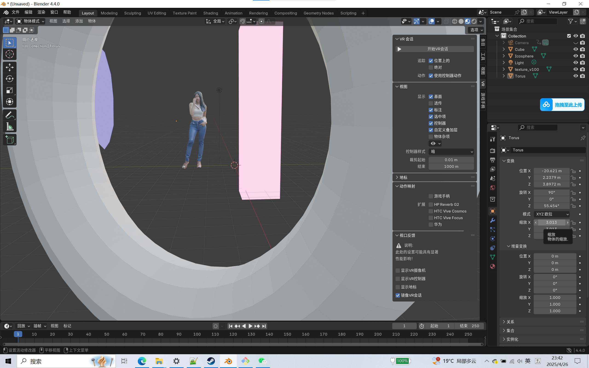
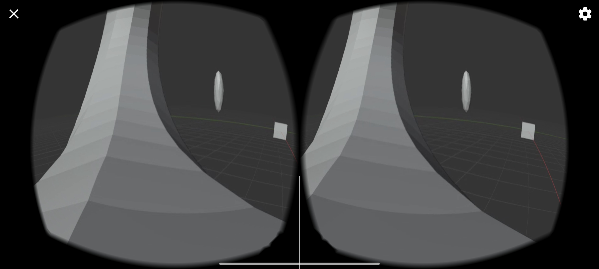
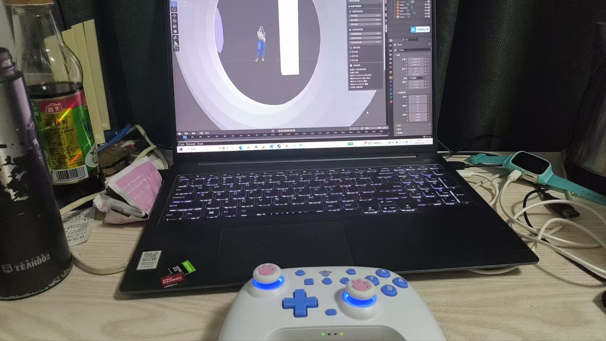

# Blender Gamepad Controls 游戏手柄控制插件

嘿！这两天心血来潮学了一下Blender建模渲染，觉得键鼠操作不够丝滑，看了看市面上的辅助键盘...emmm价格劝退。正好手边有个闲置的游戏手柄，就花了点时间搓了个Blender手柄控制插件玩玩 (・ω・)ノ

附上惨不忍睹的第一个Blender作品  ; )


## 📹 使用教程

点下边 ↓

[【Blender手柄控制插件】游戏手柄秒变生产力工具~](https://www.bilibili.com/video/BV1K7mUYkEm6/?share_source=copy_web&vd_source=703633cfd930156a4be8ec371b4bb1e6)

## ✨ 功能特性

插件实现了基础的视角和物体控制功能：

### 🎮 视角控制
- 左摇杆：平移视角
- 右摇杆：旋转视角
- A/B键：视角缩放

### 🎯 物体控制
- 左摇杆：移动选中物体
- 右摇杆：旋转选中物体
- A/B键：缩放选中物体

### ⚡️ 快捷功能
- 十字键上：切换顶视图
- 十字键下：切换前视图
- 十字键左：切换左视图
- 十字键右：切换右视图
- X键：撤销操作
- Y键：重做操作

## 📦 安装方法

### Step 1: 安装inputs包

首先需要在Blender的Python环境中安装inputs包。安装方法如下：

#### Windows系统：

1. 找到Blender的Python路径
   - 打开Blender
   
   - 在Blender中任选一个工作区窗口，点击左上角按钮，选择Python控制台，在控制台中输入以下内容后按下回车：
     
     
     
     ```python
     import sys
     sys.executable
     ```
     
   - 复制输出的路径（类似：`C:\Program Files\Blender Foundation\Blender 4.2\4.2\python\bin\python.exe`）
   
2. 安装inputs包
   - 打开Windows命令提示符（Win+R → 输入cmd → 回车）
   - 使用复制的Python路径安装inputs：
     ```bash
     "C:\Program Files\Blender Foundation\Blender 4.2\4.2\python\bin\python.exe" -m pip install -i https://mirrors.aliyun.com/pypi/simple/ --trusted-host mirrors.aliyun.com inputs
     ```
     注意：路径要根据你实际的Blender安装位置调整

### Step 2: 安装插件

1. 下载插件
   - 点击本页面右侧的 `Releases`
   - 下载最新版本的 `GamepadControls.py`

2. 在Blender中安装
   - 打开Blender
   - 点击顶部菜单的 `编辑→ 偏好设置` (或按 `Crtl+,`)
   - 切换到 `插件` 标签
   - 点击右上角的 `∨→从磁盘安装...` 选项
   - 找到并选择刚下载的 `GamepadControls.py`
   - 点击 `从磁盘安装` 按钮

3. 启用插件
   - 在插件列表中搜索 "Gamepad Controls"
   - 勾选插件名称前的复选框来启用插件
   - 等待插件加载完成

### 常见问题

1. 提示"找不到inputs模块"
   - 检查是否使用了正确的Python路径安装
   - 尝试重启Blender
2. 提示"权限不足"
   - Windows：以管理员身份运行命令提示符
   - macOS/Linux：命令前加sudo
3. 插件安装后没有显示
   - 检查是否在正确的位置启用了插件
   - 尝试重启Blender
   - 检查Blender控制台是否有错误信息
4. pip安装速度很慢
   - 建议使用阿里云镜像源，在安装命令中添加：`-i https://mirrors.aliyun.com/pypi/simple/ --trusted-host mirrors.aliyun.com`
   - 如果仍然很慢，检查网络连接或尝试使用手机热点

## 🚀 使用方法

1. 插件安装后会在3D视图的侧边栏（N键）中添加"Gamepad"标签页
2. 在标签页中可以：
   - 开启/关闭手柄控制
   - 调整各项操作的灵敏度
   - 设置轴向反转

## ⚙️ 兼容性

- 已在以下环境测试：
  - Windows 11 + Blender 4.2
- 支持大多数标准游戏手柄（Xbox Controller为主）

## 🤝 参与贡献

作为一个折腾的开始还算不错，但肯定还有很多可以改进的地方。欢迎各位Blender大佬提出建议和改进意见！如果发现了任何问题也请随时反馈，希望这个小插件能帮更多同学提升建模效率 ᕕ( ᐛ )ᕗ

- 提交Issue：发现bug或有新功能建议
- 提交PR：直接贡献代码


# ********************************************************************************
# ********************************************************************************
# ********************************************************************************

捣鼓一天了，各种坑，感谢楼主，感谢互联网，记录下状态，人多就出详细教程，可能会更到csdn上。

## 将该版本改为游戏手柄控制摄像头移动和旋转。
组合为 steamVR，phoneVR，Blender，御游Plus。
实现以虚拟视角，在blender世界里闲逛。因为blender实时渲染，可以躺在床上，将phoneVR手机戴到
头上，控制角度，用手柄左摇杆控制前后移动，右摇杆也能控制视角，只能左右转。目前只测试过一个手柄-
-----御游plus，蓝牙连接（手柄涨价了，还是从一个上学的老哥手上淘来的。为什么不要了呢，说是女友不要了，不爱
玩双人成行。。。。）

这么做有什么意义呢？如果我说，是为了留下心中的美好，这样够不够。





## 重要的事情说三遍！！！
## 重要的事情说三遍！！！
## 重要的事情说三遍！！！
要将御游plus转为xbox状态，不然边接不上。


It's been a day of tinkering.,All kinds of pits.,Thanks to the landlord.,Thanks to the Internet.,Record the status.,There are more people on the detailed tutorial.,Maybe more to CSDN.。

## Changed this version to a gamepad to control camera movement and rotation.
The combination is steamVR, phoneVR, Blender, Yuyou Plus.
Wander around the world of Blender virtually. Because blender renders in real time, you can lie on the bed and wear your phoneVR phone
On the head, control the angle, use the left joystick of the handle to control the forward and backward movement, and the right joystick can also control the viewing angle, which can only be turned left and right. I've only tested one handle so far-
----- Yuyou plus, Bluetooth connection (the price of the handle has risen, or from a school-going brother.) Why don't you want it, say that your girlfriend doesn't want it, you don't love it
Play in pairs... ）

What's the point? If I say that it is to leave the good in my heart, is this enough?
! [Blender screen photo] (assets/blender.png)
! [Blender screen photo] (assets/blender2.png)
! [VR glasses - mobile phone screenshot] (assets/phone.jpg)
! [Imperial Tour Plus] (assets/env.jpg)

## Say the important thing three times!!
## Say the important thing three times!!
## Say the important thing three times!!
You have to turn Yuyou Plus to Xbox status, otherwise you won't be able to connect to the side.